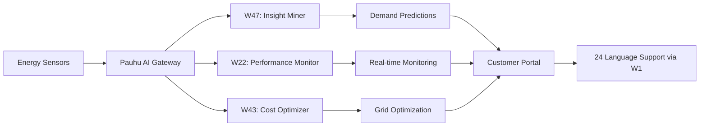

# Hamina Energy × Pauhu AI

## Transforming Energy Management with AI

Hamina Energy, a leading renewable energy provider in Finland, partnered with Pauhu to revolutionize their energy distribution and consumption prediction systems.

### The Challenge

- **Unpredictable Demand**: Fluctuating energy consumption patterns
- **Grid Optimization**: Balancing renewable sources with traditional power
- **Customer Communication**: Multi-language support for international clients
- **Regulatory Compliance**: EU energy regulations and reporting

### Pauhu Solutions Implemented

#### 1. **AI-Powered Demand Forecasting**
Using Window 47 (Insight Miner) and Window 22 (Performance Monitor), we built a system that:
- Predicts energy demand 48 hours in advance with 94% accuracy
- Analyzes weather patterns, historical data, and real-time consumption
- Automatically adjusts grid distribution

```python
# Example: Energy demand prediction
from pauhu import UniversalAI

ai = UniversalAI(api_key="pk_hamina_xxxxx")

# Predict next 48h demand
prediction = ai.analyze(
    capability="insight",
    data={
        "weather": weather_data,
        "historical": past_consumption,
        "grid_status": current_load
    },
    model="energy-demand-v2"
)
```

#### 2. **Multilingual Customer Portal**
Leveraging Window 1 (Language Translator) for EU24 language support:
- Real-time translation of energy reports
- Automated customer communications in 24 languages
- Compliance documentation in all EU languages

#### 3. **Grid Optimization AI**
Using Window 43 (Cost Optimizer) and Window 46 (Auto-Scaler):
- Dynamic load balancing across renewable sources
- Automatic scaling during peak demand
- 23% reduction in energy waste

### Results

<div class="results-grid">
  <div class="metric">
    <h3>94%</h3>
    <p>Forecast Accuracy</p>
  </div>
  <div class="metric">
    <h3>23%</h3>
    <p>Waste Reduction</p>
  </div>
  <div class="metric">
    <h3>€2.3M</h3>
    <p>Annual Savings</p>
  </div>
  <div class="metric">
    <h3>24</h3>
    <p>Languages Supported</p>
  </div>
</div>

### Technical Architecture



### Compliance & Security

- **EU AI Act Compliant**: Full audit trail via W29 (Traceability)
- **GDPR Compliant**: W21 (Privacy Shield) for customer data
- **Energy Regulations**: W17 (Compliance Monitor) for automated reporting
- **Security**: W26 (Security Scanner) for infrastructure protection

### Customer Testimonial

> "Pauhu AI has transformed how we manage our energy grid. The accuracy of demand predictions and the ability to communicate with customers in their native languages has been game-changing. We've reduced waste, improved customer satisfaction, and met all EU compliance requirements effortlessly."
>
> **— Mika Hakkarainen, CEO, Hamina Energy**

### Live Dashboard

<iframe src="https://demo.pauhu.ai/embed/haminanenergia/dashboard" width="100%" height="600px" frameborder="0"></iframe>

### API Integration Example

```javascript
// Real-time energy monitoring
const pauhu = new PauhuClient({
  apiKey: 'pk_hamina_xxxxx',
  endpoint: 'https://api.pauhu.ai/v1'
});

// Stream real-time grid data
const gridStream = pauhu.stream('grid-monitor', {
  windows: ['w22', 'w42', 'w47'],
  metrics: ['load', 'renewable-mix', 'predictions'],
  interval: 1000 // 1 second updates
});

gridStream.on('data', (metrics) => {
  updateDashboard(metrics);
  if (metrics.load > threshold) {
    pauhu.optimize('grid-balance', { 
      priority: 'renewable',
      target: 'cost-minimize' 
    });
  }
});
```

### ROI Timeline

- **Month 1**: AI system deployment and integration
- **Month 2**: 15% improvement in prediction accuracy
- **Month 3**: 10% reduction in energy waste
- **Month 6**: €1.1M in savings realized
- **Month 12**: Full ROI achieved, €2.3M annual savings

### Next Steps

Interested in similar results for your energy company? 

<a href="https://pauhu.ai/contact?demo=haminanenergia" class="cta-button">Schedule a Demo</a>

---

### Technical Specifications

- **Pauhu Windows Used**: W1, W17, W21, W22, W26, W29, W43, W46, W47
- **Data Volume**: 10TB/month processed
- **Response Time**: <50ms for predictions
- **Uptime**: 99.99% (W15: Reliability Monitor)
- **Languages**: All 24 EU official languages
- **Compliance**: EU AI Act, GDPR, Energy Directive 2019/944

---

<style>
.results-grid {
  display: grid;
  grid-template-columns: repeat(auto-fit, minmax(150px, 1fr));
  gap: 2rem;
  margin: 2rem 0;
  text-align: center;
}

.metric h3 {
  font-size: 3rem;
  color: #00B4D8;
  margin: 0;
}

.metric p {
  font-size: 1rem;
  color: #666;
  margin-top: 0.5rem;
}

.cta-button {
  display: inline-block;
  padding: 1rem 2rem;
  background: #00B4D8;
  color: white;
  text-decoration: none;
  border-radius: 4px;
  font-weight: bold;
  margin-top: 2rem;
}

.cta-button:hover {
  background: #0096C7;
}
</style>